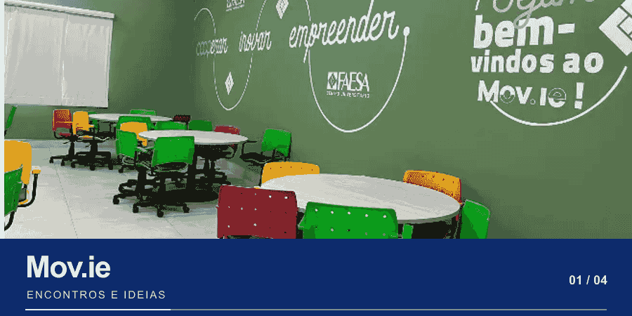

  <a href="https://connectfaesa.vercel.app/">
    <picture>
      <source media="(max-width: 600px)" srcset="docs/readme/hero-mobile.png">
      
    </picture>
  </a>

# Connect FAESA

**A vida universitária acontece junto.** Encontre estudantes da FAESA que compartilham suas matérias, habilidades e vontade de criar algo novo. Uma disciplina em comum pode ser o início de um grupo de estudos, uma parceria ou um projeto.

**[Explorar a plataforma](https://connectfaesa.vercel.app/)** · [Entender como funciona](#como-funciona)

---

## Como funciona

**01 / Mostre seu momento**

Crie um perfil com seu curso, modalidade, matérias em estudo, objetivo, habilidades e disponibilidade. As disciplinas são selecionadas a partir das grades de graduação publicadas pela FAESA para cursos presenciais e EAD.

**02 / Encontre sua turma**

Explore perfis por afinidade e filtre por nome, curso, modalidade ou matéria. Veja o que vocês estudam em comum e o que cada pessoa procura ou pode oferecer.

**03 / Conecte-se no seu ritmo**

Envie um convite, acompanhe se ele está pendente e aceite ou recuse convites recebidos. Depois da aceitação, os dados de contato são liberados; quando há um número cadastrado, você pode iniciar a conversa pelo WhatsApp.

---

## O campus também faz parte da história

  <picture>
    <source media="(prefers-reduced-motion: reduce)" srcset="docs/readme/campus-still.webp">
    
  </picture>

Mov.ie · Biblioteca · Núcleo de Prática Jurídica · Convivência

A página inicial combina uma galeria de fotos do campus com um modelo 3D de livros e canecas que responde à rolagem. A apresentação convida você a conhecer a comunidade antes de criar uma conta.

---

## Seu espaço, suas escolhas

Atualize suas matérias, objetivo e disponibilidade conforme o semestre avança. Em **Minhas conexões**, acompanhe os perfis com os quais já trocou convites. Os cards distinguem, de forma discreta, convites pendentes e conexões aceitas.

O cadastro usa e-mails institucionais `@aluno.faesa.br` ou `@faesa.br`. Perfis de estudantes são visíveis apenas para pessoas autenticadas, e WhatsApp e e-mail de contato ficam privados até que uma conexão seja aceita.
